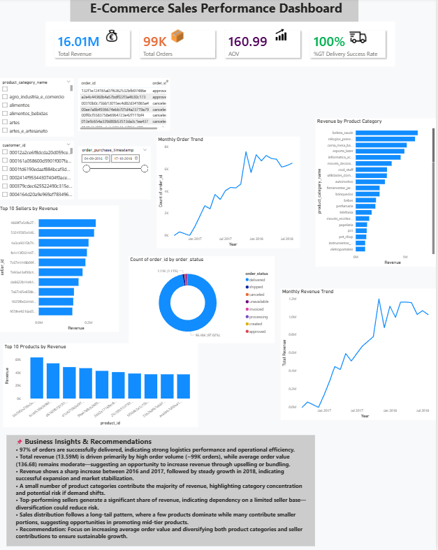
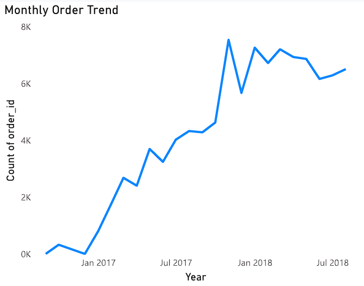
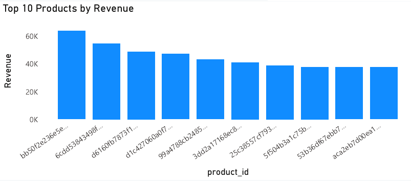
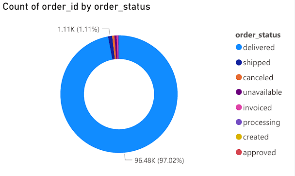

# E-Commerce Customer Insights Analysis

## 📌 Project Overview
This project analyzes an e-commerce dataset using SQL and Power BI to uncover key business insights related to revenue, customer behavior, and product performance.

---

## 📊 Key Metrics
- Total Revenue: ₹16.0M
- Total Orders: 99K
- Average Order Value: ₹160.99

---

## 📈 Key Insights
- ~97% of orders are successfully delivered, indicating strong operational efficiency
- Revenue is driven by high order volume with moderate AOV
- Strong growth observed during 2017 with stable performance in 2018
- A few product categories contribute significantly to total revenue
- Most customers make only one purchase, indicating low retention

---

## 🛠️ Tools Used
- SQL (MariaDB)
- Power BI / Excel
- Data Cleaning & Analysis

---

## 📷 Dashboard Screenshots

### Dashboard Overview

### Monthly Orders Trend

### Top Products

### Top Sellers

### Order Status Distribution

## 📂 Power BI Dashboard File

Download the full Power BI dashboard here:  
[Download PBIX File] https://drive.google.com/file/d/1ZXvuyfQrx_SDHTasKctgdsSR5pzxH1HK/view?usp=drive_link